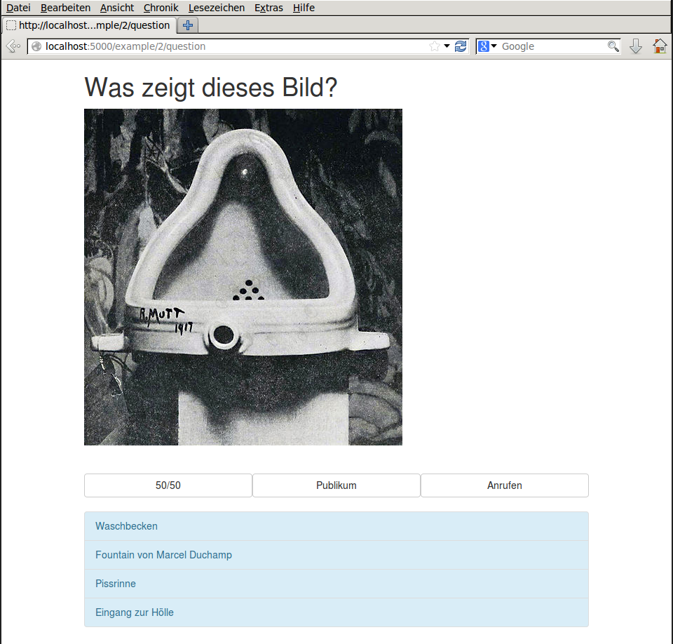

art_millionair
==============

This is a webapp for playing a 'who wants to be a millionair'-like game with custom questions. 

  

## Installation ##
1. `virtualenv -p /usr/bin/python3 art_millionair`
2. `cd art_millionair`
3. `. bin/activate`
4. `git clone https://github.com/xsteadfastx/art_millionair.git`
5. `cd art_millionair`
6. `pip install -r requirements.txt`

## Questions ##
1. create a folder in the questions-directory
2. put in text files from 0.txt to 5.txt.
3. if you want to display a image for the question: put a jpg with the number of the question in the directory. for example 0.jpg.

## Question-File-Format ##
its just a text file
- first line: question
- second line: right answer
- third to fifth line: fake answers

## Running ##
1. `python art_millionair.py`
2. point your browser to http://localhost:5000
